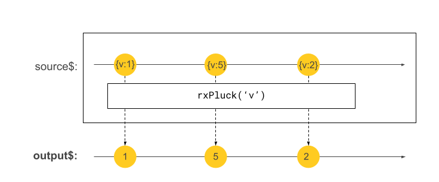

# @angular-kit/operators

A set of powerful RxJS operators for building reactive Angular applications.

## 🔋 Included

## Creation functions

- 'rxSource': create a new hot and lazy observable from a source observable or value

## Operators

### Flattening operators

#### `rxSwitchMap`

`switchMap`-operator from `RxJs` with a default error handling strategy.

Strategies:
tbd

#### `rxMergeMap`
`mergeMap`-operator from `RxJs` with a default error handling strategy.

Strategies:
tbd

#### `rxConcatMap`
`concatMap`-operator from `RxJs` with a default error handling strategy.

Strategies:
tbd
#### `rxExhaustMap`
`exhaustMap`-operator from `RxJs` with a default error handling strategy.

Strategies:
tbd


### Filter operators

- `rxFilterNull`: Filters out nullish values
- `rxFilterUndefined`: Filters out undefined values
- `rxFilterForValue`: Filters out nullish values and undefined values


> 🔥
> The filter operators will also ensure correct type inference. When using the default
> RxJs filter operators (e.g. filter(v => v !== undefined)) the type of the resulting observable
> will still contain ` | undefined` which is not what you want as you know that you filtered
> out undefined values.

 ### Other operators

#### `rxPluck`
Same as the former `pluck` operator from RxJS which got deprecated in RxJS v7.



#### `rxDistinctUntilChanged` 
A distinctUntilChanged operator that deeply compares any values efficiently

#### `rxWrap`: 
A util-operator which ensures a shared and distinct observable is used. This operator combines under 
the hood `distinctUntilChanged`, `rxFilterUndefined` and `share`.

Example
```ts

obs$ = of(10).pipe(
    rxWrap(
        map(v => v * 2),
        map(v => v + 1),
    )
)
```
